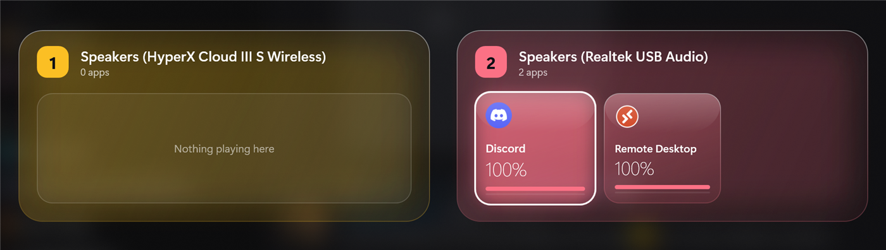

# SoundMatrix

A keyboard-driven overlay for Windows 10/11 that shows every audio output device side by side, with the apps playing on each one. Move apps between devices, change their volume or mute them without touching the mouse.



## Install

1. Download `SoundMatrix-Setup-<version>.exe` from the [latest release](https://github.com/ewanhardingham/SoundMatrix/releases/latest).
2. Run it. No admin rights are needed, and .NET is bundled.
   - The installer isn't code-signed yet, so Windows SmartScreen may warn you. Choose **More info → Run anyway**.
3. Choose whether SoundMatrix should start when you sign in.

To upgrade, run the newer installer. To uninstall, use **Settings → Apps → Installed apps**.

## Getting started

SoundMatrix runs in the system tray. Press **`Ctrl+Alt+S`** anywhere to open the overlay.

| Key | Action |
| --- | --- |
| Arrow keys | Move between apps |
| `Enter`, then `1`–`9` | Pick up an app and send it to that numbered device |
| `Space` | Mute / unmute |
| `=` / `-` | Volume up / down |
| `Ctrl+,` | Settings |
| `Esc` | Cancel, go back or close |

In **Settings** you can choose which devices get a matrix and in what order, set their colours, set the volume step, adjust the background, and rebind every hotkey.

A move changes the same per-app output that Windows keeps under *Settings → System → Sound → Volume mixer*, so it stays in place after SoundMatrix closes. Apps that choose their own output device (such as Discord and many games) ignore this setting and need to be switched from inside the app.

## Contributing

You need Windows 10/11 and the [.NET 10 SDK](https://dotnet.microsoft.com/download).

```powershell
git clone https://github.com/ewanhardingham/SoundMatrix
cd SoundMatrix
dotnet run                  # runs in the tray; Ctrl+Alt+S opens the overlay
dotnet run -- --show        # open the overlay immediately
dotnet run -- --diagnose    # write %APPDATA%\SoundMatrix\diagnose.txt: where each app is placed, and why
dotnet run -- --fake-audio  # test mode: stubbed devices and apps (Debug builds only)
```

**Test mode** (`--fake-audio`, or the *Test mode (fake audio)* launch profile) swaps the real audio system for five fake devices and fourteen fake apps with live-looking meters. They cover the awkward cases: a crowded device, an empty one, long names, muted and silent apps, and an app that appears and disappears every 8 seconds. Moving, muting and volume changes only affect the fake data, and test mode keeps its own `settings.test.json`, so it's safe to run alongside the installed app. It isn't compiled into Release builds. To add a scenario, edit the lists in `Audio/FakeAudioService.cs`.

| Path | What's there |
| --- | --- |
| `Audio/` | `IAudioService`, with the real WASAPI implementation (sessions via NAudio, per-app routing through the undocumented `AudioPolicyConfig` API) and the fake one for test mode |
| `UI/` | Overlay window, in-overlay settings panel, glass styles |
| `Core/`, `Interop/` | Settings (JSON in `%APPDATA%\SoundMatrix`), hotkeys, Win32 calls |
| `installer/` | Inno Setup script |

1. Fork the repo and create a branch.
2. Make your change and check it with `dotnet run`.
3. Open a pull request against `main`. CI builds the app and the installer.

Every merge to `main` publishes a new release with an installer automatically, so keep `main` releasable. Changes that only touch docs don't trigger a release.

## License

[MIT](LICENSE)
